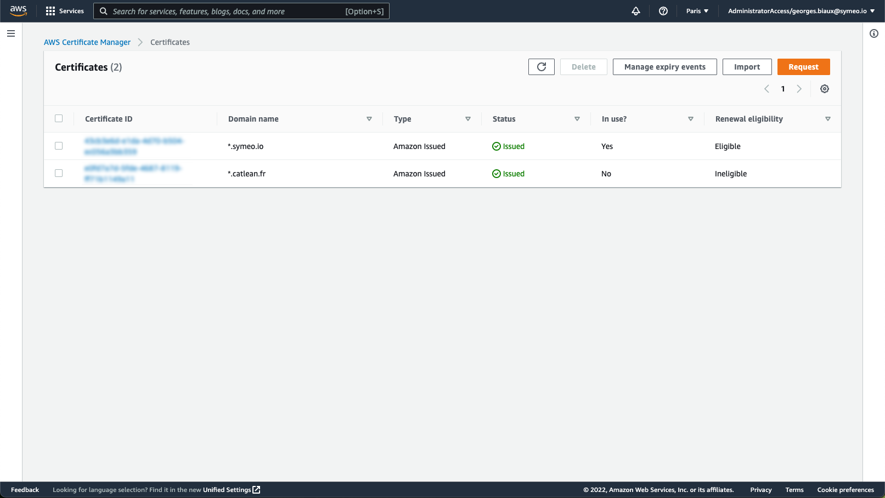
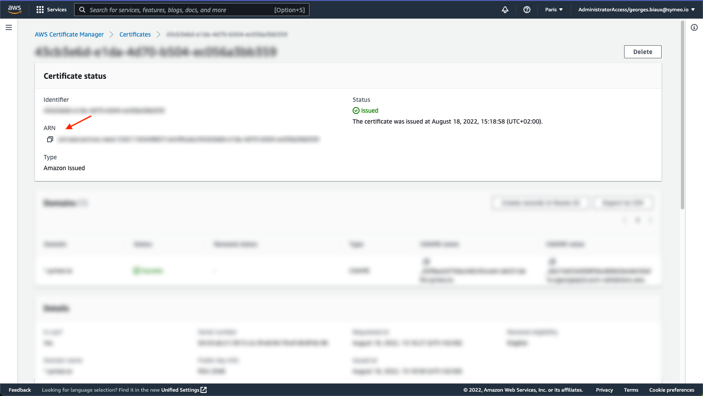
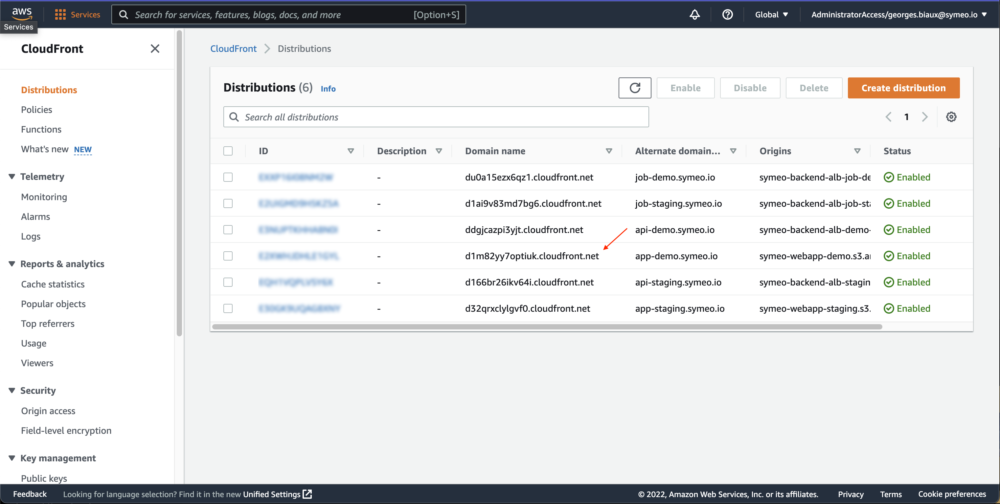

# How to create a new environment

## Gather necessary environment variables

The build infrastructure scripts and pipeline need several env variables to run:

- `AWS_REGION`: The aws region to deploy to (here we use the one for Paris: eu-west-3)
- `ENVIRONMENT`: The name of the env (staging, demo or production for example)
- `PREFIX_URL_FRONTEND`: The prefix for the frontend subdomain (app-staging, app-demo or app)
- `DOMAIN`: The domain name to use (here symeo.io).
- `ACM_ARN`: The ARN for the AWS certificate (in us-east-1 region), corresponding to the chosen domain. This can be found in the [AWS console](https://us-east-1.console.aws.amazon.com/acm/home?region=us-east-1#/certificates/list):

## Create the new circleci context

To store environment variables, we use circleci contexts. 

To create the context for the new environment

- Go to the [organization context settings page](https://app.circleci.com/settings/organization/github/symeo-io/contexts) and click "Create Context".
- Name your context (staging, demo or production for example) and then click "Create Context".
- In the newly created context, set all the environment variables listed in the previous step.

## Update the circleci configuration

Infrastructure and deploy pipeline are run using circleci. The configuration must be updated to create a new environment:

- Go to the [.circleci/config.yml](./.circleci/config.yml) file
- In the `workflows:` section, under `webapp:` and `jobs:`, duplicate the `deploy:` section (do not rename it, all of them must be named "deploy")
  - Replace the previous environment context name with the new one under `context:`
  - Replace the previous branch name in `filters:branches:only:` with the new environment branch name (should be the same as the context name)
- In the `workflows:` section, under `build-infrastructure:` and `jobs:`, duplicate the `build-aws-infrastructure:` section (do not rename it, all of them must be named "build-aws-infrastructure")
    - Replace the previous environment context name with the new one under `context:`
    - Replace the previous tags pattern in `filters:tags:only:` with the new environment tag name pattern

## Build infrastructure

Once the circleci configuration is up-to-date, tag your commit with the pattern corresponding to your new environment:

- `git tag infrastructure-demo-01-01-1970-1` for example
- `git push origin infrastructure-demo-01-01-1970-1` for example

This will trigger the infrastructure build on circleci

## Deploy frontend

Create the new branch corresponding to the environment and push it to deploy for the first time

- `git co -b demo` for example

## Register DNS entry

- Get the newly created cloudfront url (for the frontend url, app-demo.symeo.io for example) in the [AWS console](https://us-east-1.console.aws.amazon.com/cloudfront/v3/home?region=eu-west-3#/distributions):

- Go to the [OVH console](https://www.ovh.com/manager/#/web/domain/symeo.io/zone), and add a new entry
  - type: CNAME
  - sub domain: your frontend prefix (example: app-demo)
  - target: the cloudfront url

